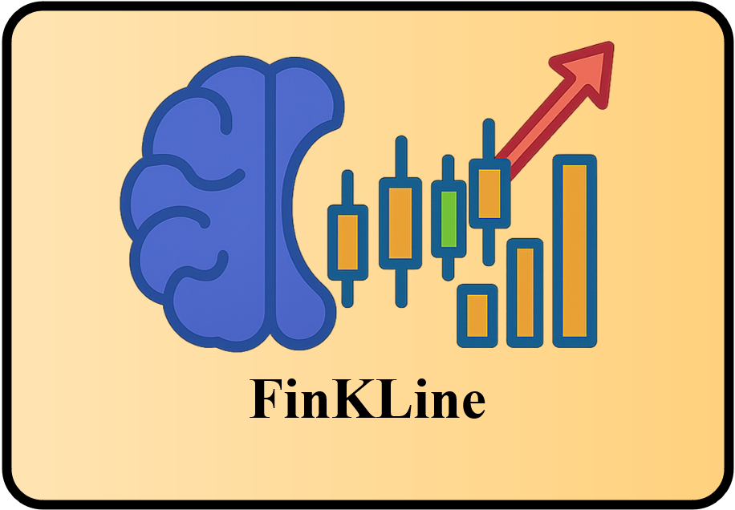

<p align="center">
  
</p>

<h1 align="center">FinKLine Dataset & Resources</h1>

<p align="center">
  📈 Multimodal Financial Reasoning · 🧠 Chain-of-Thought · 🧩 Stage-wise Post-training · 🔁 Rolling Prediction Evaluation
</p>
<p align="center">
  <a href="#english">English</a> · <a href="./README_zh.md">中文</a>
</p>


## 🌍 English

### ✨ Overview
This repository releases the dataset resources used in the **FinKLine** framework for **multimodal financial reasoning** and **multi-step stock price forecasting**.  
It provides image folders, **stage-wise training data** (Stage I to Stage III), and **two test sets**, including a **rolling prediction** protocol that simulates realistic deployment.

### 📦 What’s inside
- 🖼️ **Training sample images (preview)**
  - `images/20250303` contains **30** candlestick chart images for quick inspection.
  - **20250303：**https://drive.google.com/drive/folders/1hvIB3hcNnSmiGsFFMdWZrAMSZvQQ6dOT?usp=drive_link
- 🔁 **Rolling prediction test images**
  - `imagestest-0317/20250317` contains **500** images for rolling prediction evaluation.
  - **20250317：**https://drive.google.com/drive/folders/1EmrBaq5ba5RY-Sd-9I3pUBcoEbNOmv8J?usp=drive_link
- 🧪 **FinKLine-DB-test images**
  - `imagestest-0825/20250825` contains **500** images for the standard test set.
  - **20250825：**https://drive.google.com/drive/folders/1dOFwPrwHrxWwv-DNPvzAmsDweXxCzSuD?usp=drive_link
- 🧩 **Stage-wise training sets**
  - `Stage I/train_27196_cot.csv`
  - `Stage II/train_4520_png_cot.json`
  - `Stage III/train_4520_regs_cot.json`
- ✅ **Test sets**
  - `test/test_500_png_cot.json`  
    Rolling prediction set with inputs built from the training period and outputs in the test period
  - `test/test_500_png_08_cot.json`  
    Standard test set for FinKLine-DB-test

### 🔁 Rolling prediction protocol
To evaluate **FinKLine-7B** in realistic settings, we simulate rolling prediction with a fixed historical window.  
We use **2025-03-17** as the temporal boundary. Inputs are constructed from the training period, and the task is to predict the **four-day closing price sequence** from **2025-03-18 to 2025-03-21**.  
This setting is used to compare FinKLine-7B against representative multimodal model baselines and stage-wise ablations, as reported in **Table 4** of our paper.

### 🗂️ Repository structure
```text
.
├── assets/
│   └── finKLine-icon.png          # icon used in README
├── images/
│   └── 20250303/                  # 30 training sample images
├── imagestest-0317/
│   └── 20250317/                  # 500 images for rolling prediction evaluation
├── imagestest-0825/
│   └── 20250825/                  # 500 images for FinKLine-DB-test
├── Stage I/
│   └── train_27196_cot.csv         # Stage I training data
├── Stage II/
│   └── train_4520_png_cot.json     # Stage II multimodal SFT data
├── Stage III/
│   └── train_4520_regs_cot.json    # Stage III rule-guided SFT data
└── test/
    ├── test_500_png_cot.json       # rolling prediction test set
    └── test_500_png_08_cot.json    # FinKLine-DB-test
```

### 🏷️ File naming convention

Images are organized by date folders and follow the pattern:

- `000001_20250303.png`
- `000001_20250317.png`
- `000001_20250825.png`

### 📌 Citation

If you use this repository, please cite our paper:

```
```

You may update bibliographic fields after acceptance.

### 📬 Contact

For questions or access to additional materials, please contact the authors via the email provided in the paper.
